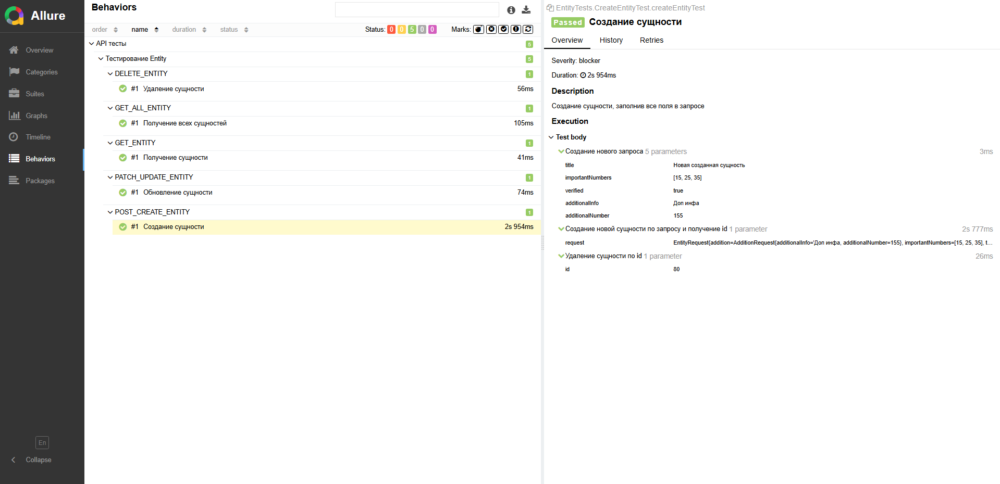

# SSP_SDET
SimbirSoft Practicum - SDET specialist

## Task 3
Тестирование [API-сервиса](https://github.com/bondarenkokate73/simbirsoft_sdet_project)

* Создание сущности: POST /api/create
* Получение сущности: GET /api/get/{id}
* Получение всех сущностей: GET /api/getAll
* Обновление сущности: PATCH /api/patch/{id}
* Удаление сущности: DELETE /api/delete/{id}

### Дополнительные задания:
1) Allure отчет

2) Паралельный запуск тестов\
testng.xml (classes, 5 threads)
3) Запуск в системе CI/CD\
gitHub Actions