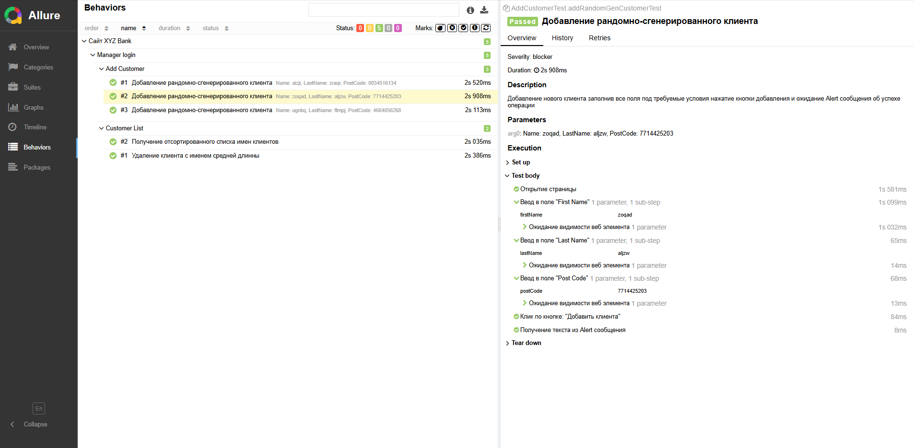

# SSP_SDET
SimbirSoft Practicum - SDET specialist | Тестовое задание

**Язык:** Java 17 - Maven\
**Используемые инструменты:**
* TestNG (v 7.10.2)
* Selenium WebDriver (v 4.36.0)
* Allure Report (v 2.30.0)

## My test cases:
    Тест-кейс №1 (позитивный)
**Предусловие:**
1) Открыть браузер
2) Перейти по ссылке https://practice-automation.com/form-fields/ 

**Шаги:**
1. Заполнить поле Name
2. Заполнить поле Password
3. Из списка What is your favorite drink? выбрать Water и Wine
4. Из списка What is your favorite color? выбрать Green
5. В поле Do you like automation? выбрать Undecided
6. Поле Email заполнить строкой формата name@example.com
7. В поле Message написать все инструменты в алфовитном порядке,\
описанных в пункте Automation tools.
8. Нажать на кнопку Submit\

**Ожидаемый результат:**\
Появился алерт с текстом Message received!

    Тест-кейс №2 (негативный)
**Предусловие:**
1) Открыть браузер
2) Перейти по ссылке https://practice-automation.com/form-fields/

**Шаги:**
1. Поле Name оставить пустым
2. Заполнить поле Password
3. Из списка What is your favorite drink? выбрать Ctrl-Alt-Delight
4. Из списка What is your favorite color? выбрать Red, а потом Blue
5. В поле Do you like automation? выбрать Yes
6. Поле Email заполнить строкой формата name@example.com
7. Поле Message оставить пустым 
8. Нажать на кнопку Submit\

**Ожидаемый результат:**\
Страница перейдет на поле Name, алерт не появился, форма не отправилась

## Allure отчет:

