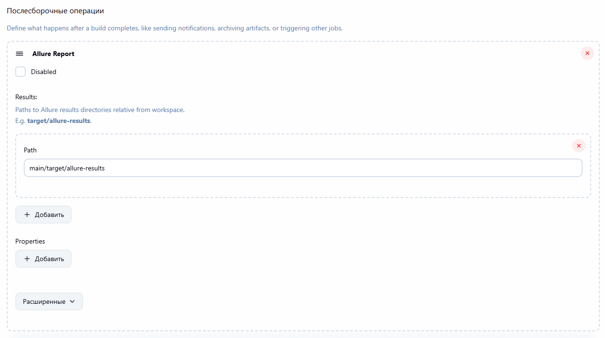
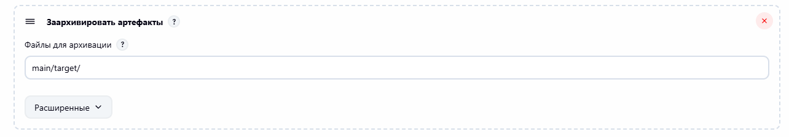

# CI-2
## Подключение Allure в Jenkins и его архивация.
Для каждого прогона сохраняется артефакт allure-отчета. \
В айтеме показана статистика history thread в виде графика.

История allure отчетов после каждого прогона в виде графика

## Настройки
Подключение allure

Архивация allure отчета
