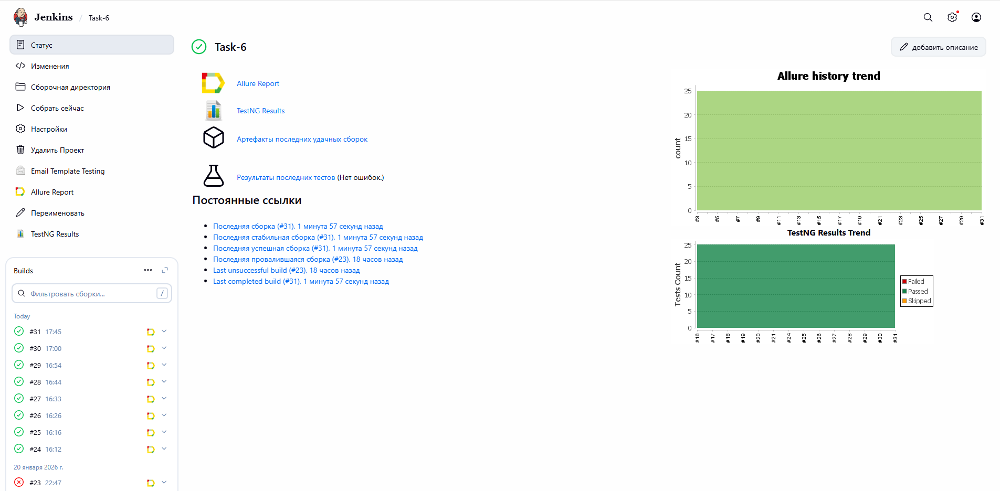
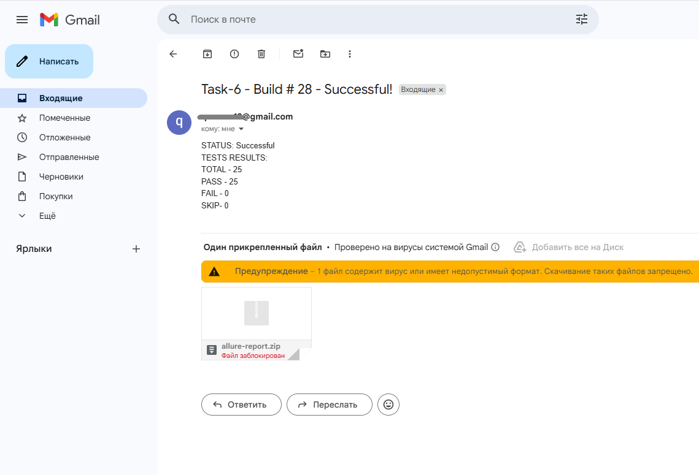
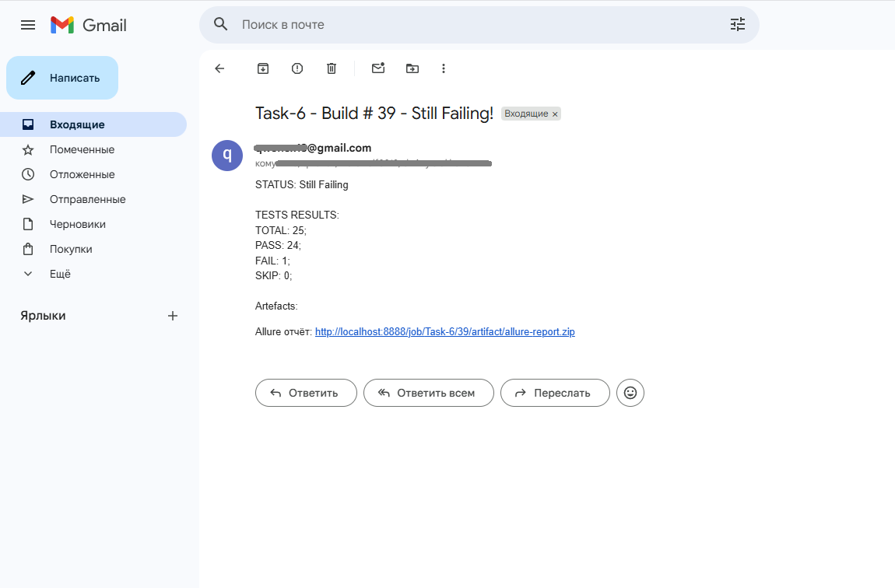
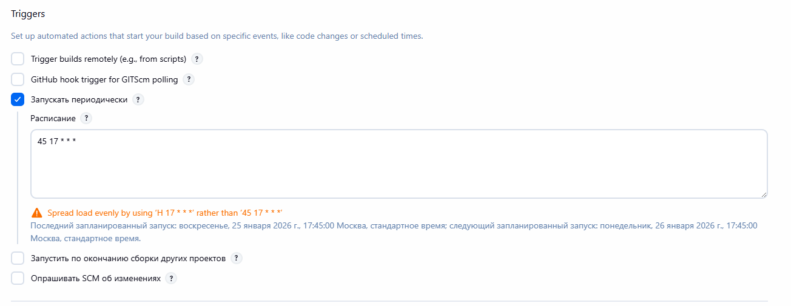
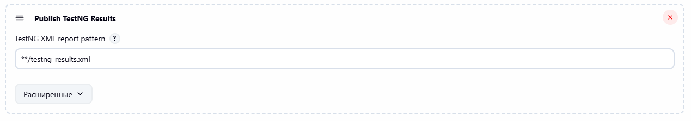
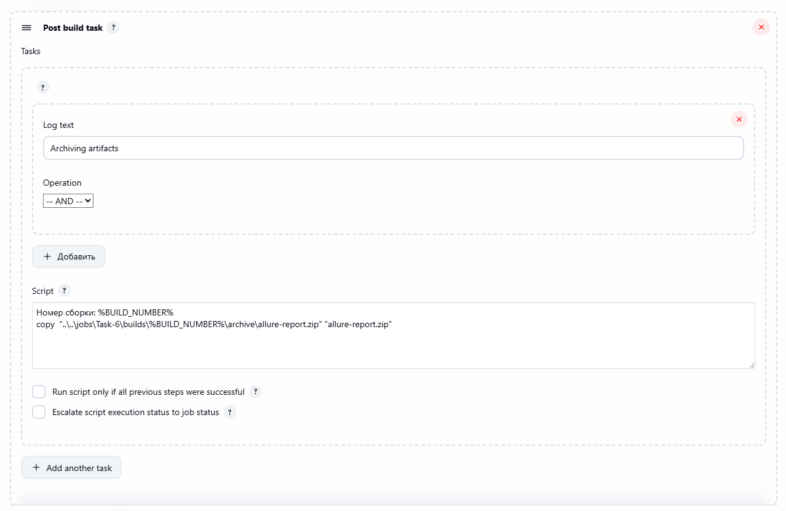
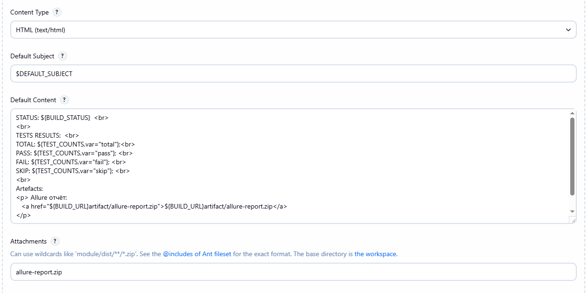
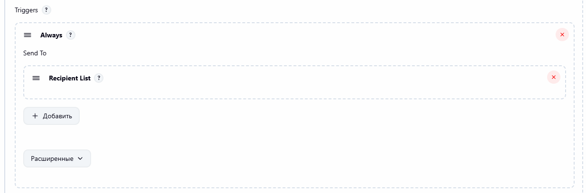
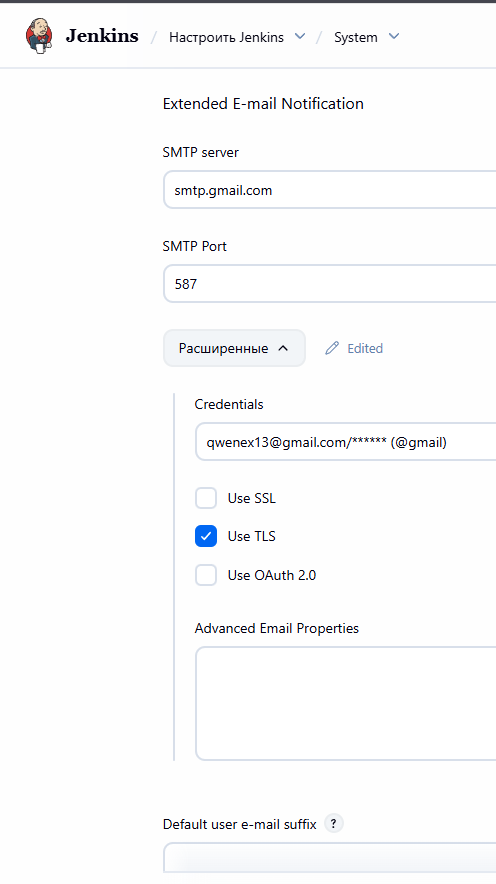
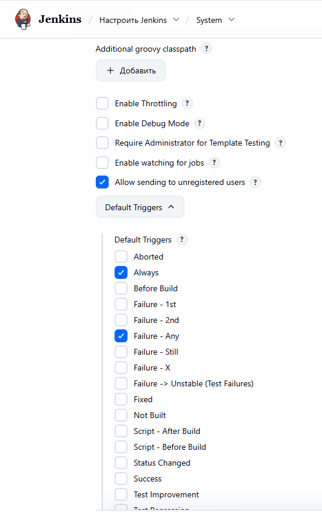

# CI-3
## Регулярный запуск авто-тестов и оповещение по почте.

Письмо с приложенным allure отчетом в виде zip-файла

Письмо с приложенным allure отчетом в виде ссылки\
(Один тест специально провален для наглядности)

## Настройки
Регулярный запуск в 17:45 каждого дня (cron)

Подключение плагина testNG для сохранения отчета, \
из которого берутся данные для отправки статистики по почте

Подключение плагина post-build-task. С помощью тригера в выводе консоли запускается скрипт\
копирования папки с allure отчетом из артефактов сборки в сборочную директорию,\
чтобы можно было приложить этот zip-файл с отчетом к письму.
* Важно! Google блокирует рассылку сообщений с приложенными zip-файлами.\
  (как альтернативу можно использовать ссылку на отчет в теле письма)

Плагин Extended Email Publisher
Html формат в тело письма для отправки динамического отчета после каждого прогона

Тригер на always
 \
Системные настройки для отправки сообщений \

