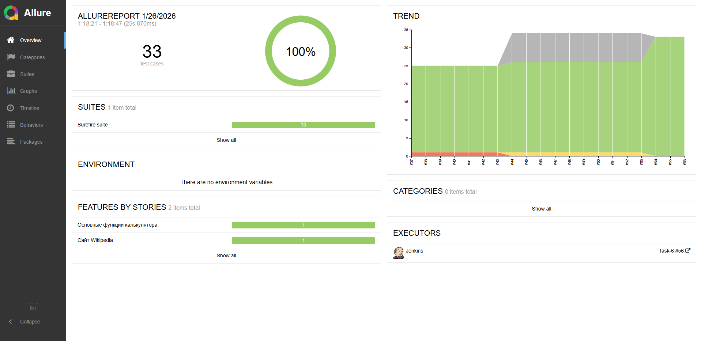
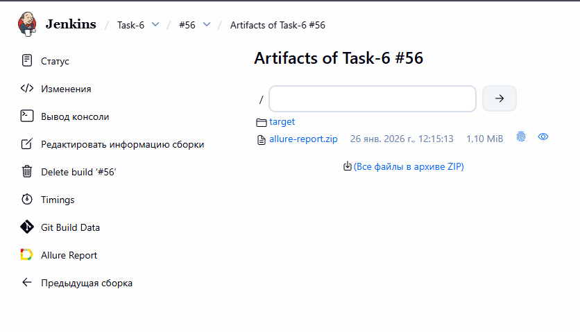
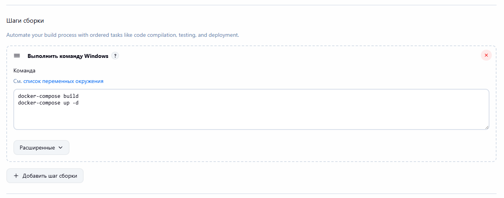
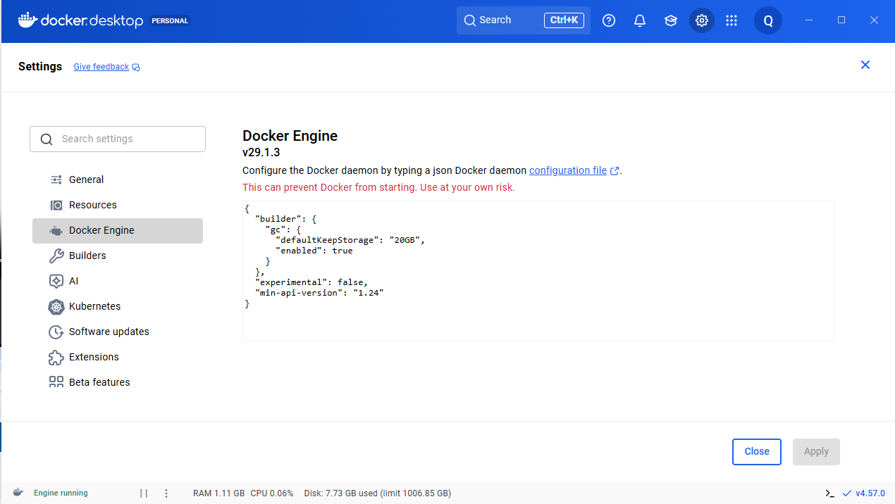

# CI-4
## Запуск тестов в Docker
Используется 3 контейнера app + selenoid + selenoid ui через docker-compose \
В качестве ui тест кейсов - проверка дат рождения и смерти известных личностей на сайте wikipedia

Сохранение в артефакты сборки allure отчета и папки target

## Настройки
Вместо шага "Вызвать цели Maven", выполняется команда windows. (Запуск maven прописан внутри докера)

### Настройка-памятка selenoid без docker-compose:
В командной строке в директории с selenoid: 
* Запуск selenoid - cm_windows_amd64.exe selenoid start \
(запускается так же на порте 4444) 
* Запуск selenoid ui - cm_windows_amd64.exe selenoid-ui start \
(запускается на порте 8080) 
* Обновление selenoid и браузеров - cm_windows_amd64.exe selenoid update
* Должен быть запущен docker desktop, если выдает ошибку про версию,\
в настройках docker указать "min-api-version":"1.24"
